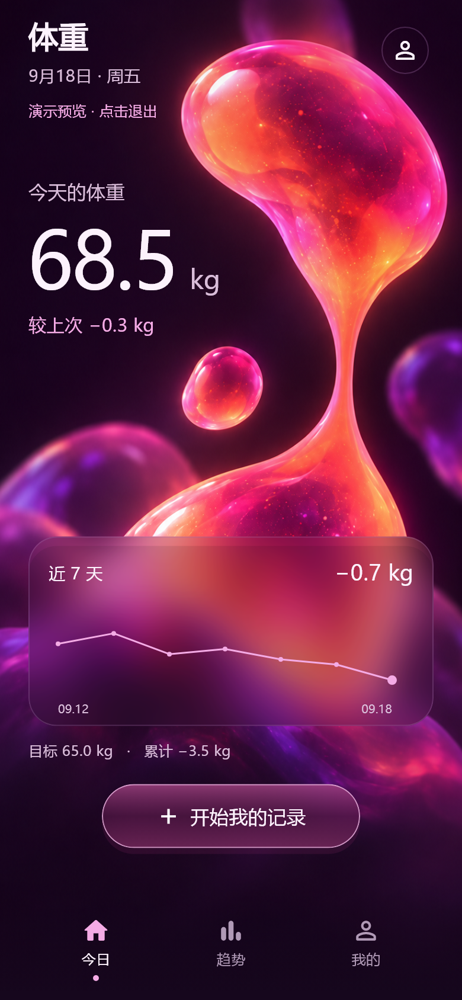
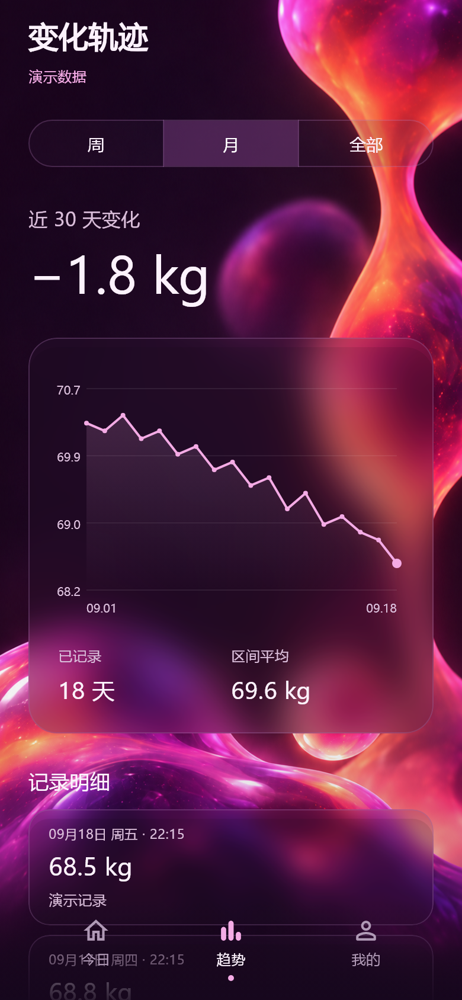
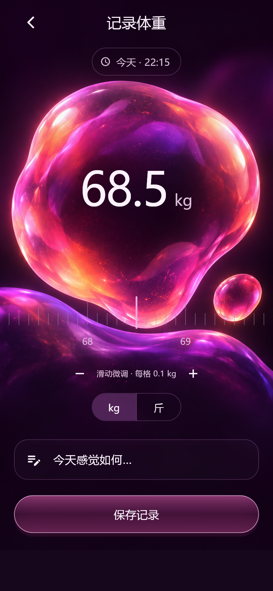
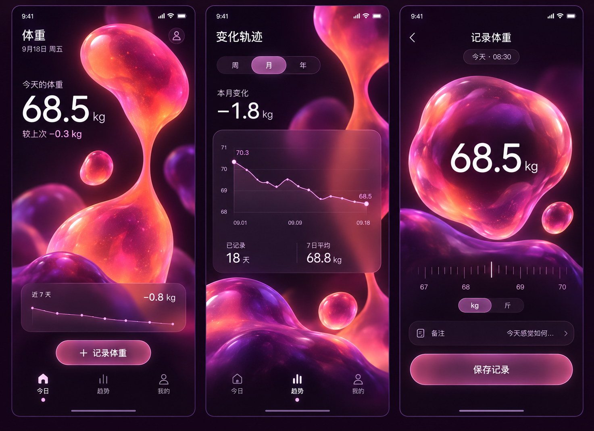

# LavaWeight · 流光体重

[](LICENSE)
[](android)
[](https://flutter.dev)
[](https://github.com/YXX168/LavaWeight/actions)

> 炫酷、沉浸、治愈的液态灯美学 Android 体重记录与趋势分析应用。
> 告别枯燥单调的体检打卡表，让每一次身体变化都成为有光流动的数据艺术。

---

## 界面实拍效果

| 今日概览 (Home) | 变化轨迹 (Trends) | 记录体重 (Record) |
| :---: | :---: | :---: |
|  |  |  |

---

## 视觉概念与设计语言



LavaWeight 灵感源自经典熔岩灯（Lava Lamp）与流光玻璃艺术：
- **深曜石紫黑背景**：告别刺眼白光，在夜间与晨起时都能带来舒适柔和的护眼视觉体验。
- **透光熔融液态质感**：粉橙桃红的液团自下而上缓缓呼吸，内部透出温暖的光泽。
- **真实毛玻璃拟态**：多层实时高斯模糊、微光高亮边缘与轻盈半透明悬浮卡片。
- **交互式趋势曲线**：连贯的平滑波动轨迹，支持手指触摸滑动探针实时查看历史记录。

---

## 核心功能

### 1. 今日概览 (Home)
- **大字号焦点数值**：清晰展示当日体重与较上一次称重的差值波动。
- **目标与初始进度**：对比起始体重、目标体重与累计减重成果。
- **近 7 天迷你趋势**：直观浏览近期波动态势。

### 2. 趋势轨迹 (Trends)
- **多维度周期切换**：支持「周」、「月」、「全部」区间切换。
- **区间统计看板**：自动统计打卡天数、区间日均体重与变化幅度。
- **交互式曲线**：在图表区域任意滑动，即可高亮十字准星并弹出该时刻的确切时间与体重。
- **明细记录管理**：支持点击编辑或删除记录，带有防误触二次确认。

### 3. 极速记录 (Record)
- **悬浮液态球交互**：体重数值自然悬浮于居中液态光球之上。
- **触感刻度尺 (Lava Ruler)**：支持横向惯性平滑滑动，同时配备 `+0.1kg` / `-0.1kg` 微调步进按钮与震动反馈。
- **单位一键切换**：支持 `kg` 与 `斤` 双单位无感切换。
- **随手备注**：可记录空腹、运动后或生活感受。

### 4. 个人与隐私设置 (Settings)
- **100% 本地优先**：无注册登录、无云端追踪、无需联网，基于本地 SQLite 存储。
- **备份与迁移**：一键将完整历史数据导出为标准 JSON 复制到剪贴板，支持跨设备导入恢复。
- **演示数据预览**：内置独立演示数据模式，仅供查看效果，绝不污染真实个人记录。

---

## 工程结构

```text
LavaWeight/
├── .github/workflows/
│   └── build.yml               # GitHub Actions CI：格式检查、静态分析、测试、视觉渲染与 APK 构建
├── android/                    # Android 原生工程（Kotlin DSL、矢量自适应图标、全屏沉浸式主题）
├── assets/
│   ├── images/                 # 高分辨率全屏液态灯背景切图
│   └── screenshots/            # 真实页面渲染截图
├── lib/
│   ├── main.dart               # 入口程序与沉浸式状态栏配置
│   ├── models/                 # 数据模型 (WeightRecord, UserProfile)
│   ├── services/               # 核心逻辑 (StorageService, StateStore, WeightStats, DateHelper)
│   ├── theme/                  # 视觉系统 (LavaTheme 配色、光效渐变、毛玻璃装饰)
│   ├── widgets/                # 定制组件 (GlassCard, GlowingButton, LavaRuler, LavaTrendChart, LavaBackground)
│   └── views/                  # 业务页面 (HomeView, TrendsView, RecordView, SettingsView, MainScaffold)
└── test/                       # 单元测试、状态存储测试、组件测试与视觉渲染测试
```

---

## 本地运行与测试

```bash
# 1. 获取依赖
flutter pub get

# 2. 静态分析与测试
flutter analyze
flutter test --exclude-tags visual

# 3. 构建 Android Release 安装包
flutter build apk --release --target-platform android-arm64
```

---

## 开源协议

本项目采用 [MIT License](LICENSE) 开源协议。